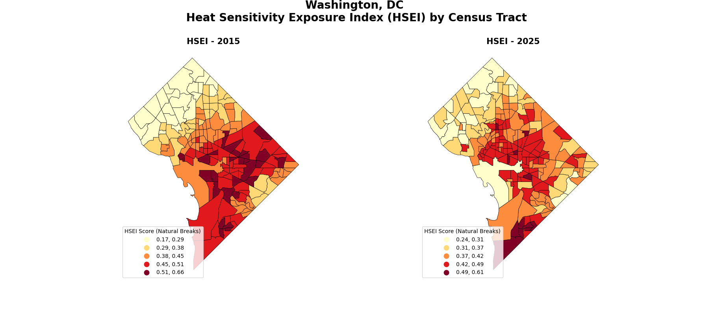
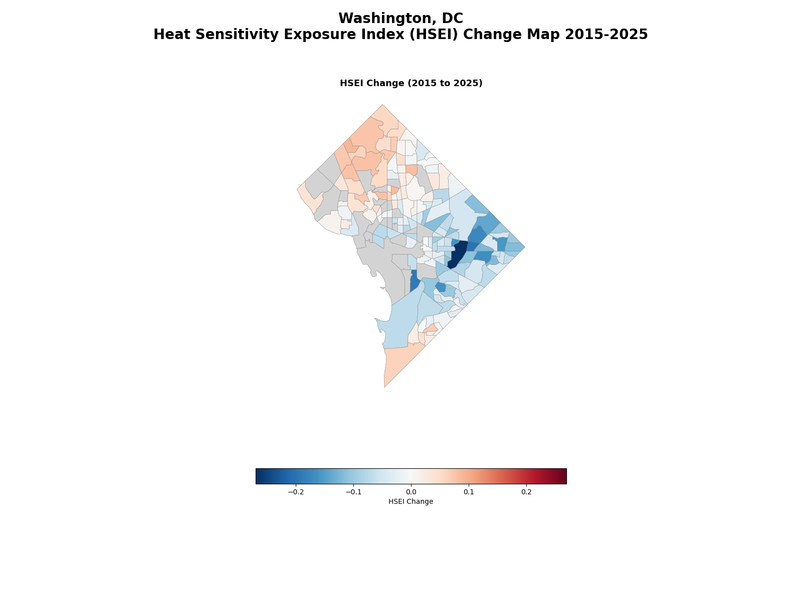

# GEOG3198 Final Project

This repository contains the code for the final GIS Project of the GEOG3198 course.

## Project Description

The objective of the project is to develop a Heat Sensitivity Exposure Index (HSEI) using a Multi Criteria Evaluation (MCE) and time series change detection. This index will aim to assist in both the assessment of current extreme heat planning efforts and the forecasting of future heat sensitivity and exposure trends in major urban areas across the United States. 

This application aims to provide a fully automated open-source system that compiles, processes, analyzes, and displays the result index data for the city of Washington, DC. It will identify the most vulnerable census tracts based on environmental, socio-economic and demographic variables.

## Quickstart

To run the program, clone the repository and run the `final_project_IN_MW.ipynb` Jupyter Notebook. You must have an appropriate conda environment that has all of the necessary libraries.

The following python libraries are required dependencies:
```python
geopandas
pandas
rasterio
matplotlib.pyplot
matplotlib.patches
matplotlib.gridspec
numpy
glob
rasterstats
```

A guide to git for beginners was provided in `git_guide.md`

## Project results & Outputs

The following change detection maps were created, and additional statistics were calculated (Refer to the in-book documentation in `final_project_IN_MW.ipynb`)

Visual Change Detection -- 2015 & 2025


Positive/Negative Change Detection -- 2015-2025
