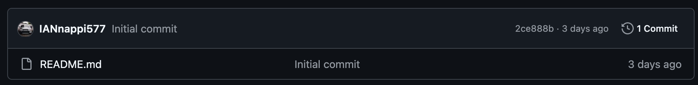

## Guide to Using Github with Git

### Common git terminology:
- `repository` or `repo`: The location where our code lives online. Basically the cloud backup that everyone can see and have access to.
- `push`ing files: uploading files to the online repository. Like clicking save on Microsoft Word
- `pull`ing files: copying all changes from the online repository to your local VSCodium. Similar to refreshing a webpage to see the latest changes.
- `commiting` files: an intermediate step in pushing files. Like verifying that you want to make changes before you actually do it.

### The most important commands

#### Git Push: transfer code you wrote on your computer to the online respository. Essentially, "push" code to the repository

1. Write some code
2. Open a terminal shell in VSCodium, which opens along the bottom screen
3. type `git status`, you should see a list of $\color{Red}{\textsf{red}}$ files. Those are files not yet "committed" to be pushed
4. type `git add -A` --> this adds all the red files to your "stage"
5. type `git commit -m "<your message>"` where you replace `<your message>` with a short description of what you changed. Make sure to include quotes around the message. For example, `git commit -m "finished code for myfunction()"`.
6. type `git push` --> this will push your changes to the repository
7. If you want to verify that it worked, go to the <a href="https://github.com/IANnappi577/GEOG3198_Final_Project">repository URL</a> and see if your name and commit message shows up under the commits banner here:

#### Git Pull: update your local computer's copy of the code with any changes the other person made. Essentially, "pull" from the repository

1. Open a terminal shell in VSCodium, which opens along the bottom screen
2. type `git status`

    --> If you see a list of $\color{Red}{\textsf{red}}$ files, stop. This means you have code in your local directory you haven't saved yet. This is the same thing as having unsaved changes in Microsoft Word. Don't continue with any more steps. You can do 2 things: 1) follow the `git push` instructions to push these changes to the repository, or 2) ask me if you're uncertain.

    --> If you don't see any $\color{Red}{\textsf{red}}$ files, you're good to go, move on to step 3.

    --> **Exception:** if you DO have $\color{Red}{\textsf{red}}$ files, but you _still_ want to do a `git pull`, you do have an option to override your current work and do it anyway. Ask me if this is something you want to do, and if so, skip to the Danger Steps below

3. IF you don't have red files, type `git pull origin main` --> this will pull the code from the repository onto your local computer

> If there are any errors that are thrown in this process, just text me the error codes. Git can get really finiky really quickly if you do something just slightly off, so I don't blame you if it's confusing.

----

#### The Danger Steps: resetting your current branch and pulling anyway

I would NOT recommend doing any of the below steps before asking me, because I would hate it if any code you wrote got erased by accident.

**DANGER:** This method WILL override your current working directory and ALL of the work you currently have. If there is any code that you wrote that is not saved to the repository, it WILL be deleted with this method and **cannot be recovered**. _This is the same thing as quitting Microsoft Word without saving your changes._

1. Open a terminal shell in VSCodium if it is not already open
2. type `git reset --hard` ## $\color{Red}{\textsf{This is the kill command}}$: This WILL erase everything on your local drive, so be **extra sure** you want to do this before running this command
3. type `git clean -fd`

--- 

### FAQ

#### When should I push new code I wrote?

You can push as often or as infrequently as you'd like! Our repository has no rules, unlike what I need to follow for my capstone project haha. (just _maybe_ not too many commits, like less than 20 times a day, because then the repo will start to get a little messy)

--> More FAQs as they come up